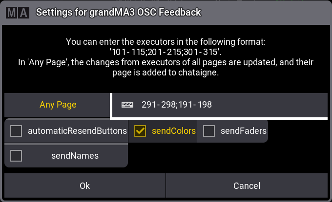
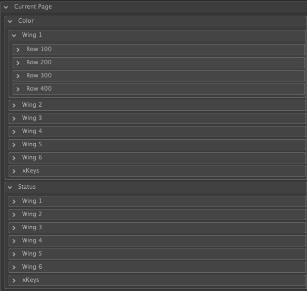
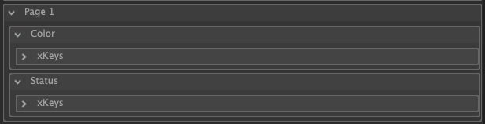

# grandMA3 Feedback Chataigne Module

This Chataigne module allows you to receive feedback from grandMA3 via OSC and an LUA plugin.

**WARNING**: This module is in development and may not work as expected. Use at your own risk. Not show ready!
Feel free to give feedback or report issues.

## Features

The module provides the following feedback from grandMA3:

- **Color Value**
- **Button State**
- **Fader Value**
- **Sequence Name**

Feedback is sent for all executors (Wing 1 - 6 + XKeys) on the current page, as well as for the 'Any Page' executors specified in the grandMA plugin. Updates for the specified executors are sent for all existing pages.

## Setup Instructions

1. **Download the Plugin for grandMA 3:**
  - Download the latest version of the grandMA3 OSC Feedback plugin folder (named `grandMA3_OSC_Feedback_3.0.0.3`) from this repo.
  - Move the downloaded file to the following directory: `MALightingTechnology/gma3_library/datapools/plugins`.

2. **Import the Plugin in grandMA3:**
  - Follow the instructions in the [grandMA3 Plugin Import Guide](https://help.malighting.com/grandMA3/2.2/HTML/plugins.html) to import the plugin.

3. **Configure Plugin Settings (optional):**
  - Click on the plugin in grandMA3, select "Settings," and adjust the settings as needed. The necessary OSC settings will be created automatically.
  - In the [OSC Menu](https://help.malighting.com/grandMA3/2.2/HTML/remote_inputs_osc.html), ensure that "Enable Input" and "Enable Output" are checked at the top.
  - For more details, refer to the [Plugin-Settings section](#grandma3-plugin-settings).

4. **Add the grandMA3 Module in Chataigne:**
  - In your Chataigne project, add the grandMA3 Feedback module. Verify that port "8093" is set as the OSC Input.

5. **Start the Plugin:**
  - Click on the plugin and select "Start." The plugin will now begin sending updates to Chataigne.

## grandMA3 Plugin Settings

- **Any Page:** Select the executors that should send feedback for all pages. This is useful if you want to receive feedback for executors (e.g., exec 101) across multiple pages, regardless of the currently selected page in grandMA3.
- **automaticResendButtons:** If set to true, the plugin will automatically resend feedback every second.
- **sendColors:** If set to true, the plugin will send the color value of the executor.
- **sendFaders:** If set to true, the plugin will send the fader value of the executor.
- **sendNames:** If set to true, the plugin will send the name of the sequence associated with the executor.

## Chataigne Module Settings

- Chataigne values are split up the following:
  - Current Page
    - Wing 1
      - Row 100
      - Row 200
      - Row 300
      - Row 400
    - Wing ...
  - Page X
    - Wing X
      - Row X

How many Pages are displayed depends on the number of pages you have in grandMA3. The module will automatically detect the number of pages and display them accordingly together with the in the grandMA plugin selected executors.

## Troubleshooting

- If you are not receiving any feedback, check the following:
  - Ensure the plugin is running and that the OSC settings are correctly configured.
    - In the [OSC Menu](https://help.malighting.com/grandMA3/2.2/HTML/remote_inputs_osc.html), select the correct interface and allow the destination IP to autofill (click it, remove the value, and save).
  - Verify that the port is set to 8093 in both Chataigne and grandMA3.
  - Confirm that your grandMA3 network settings are correct. The plugin will only function if the grandMA3 is connected to the same network as Chataigne.
- If any port issues occur, try starting Chataigne FIRST and then grandMA3. This is a known issue with grandMA3, and it may not work if the plugin is started before Chataigne. Maybe also try restarting the whole PC, and starting the software in the order of Chataigne -> grandMA3 -> grandMA3 plugin. The error is reported to MA.

## Shoutout's
- [xxpasixx](https://github.com/xxpasixx/pam-osc) for creating the original pam-osc plugin for grandMA3 which I rewrote for the usage of this project